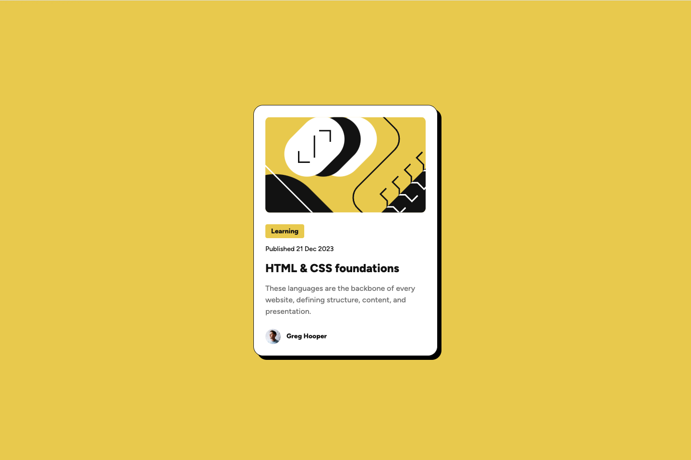
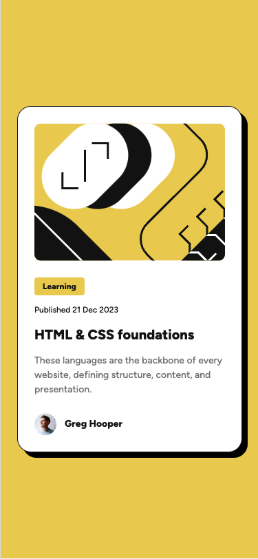

# Frontend Mentor - Blog preview card solution

This is a solution to the [Blog preview card challenge on Frontend Mentor](https://www.frontendmentor.io/challenges/blog-preview-card-ckPaj01IcS). Frontend Mentor challenges help you improve your coding skills by building realistic projects.

## Table of contents

- [Frontend Mentor - Blog preview card solution](#frontend-mentor---blog-preview-card-solution)
  - [Table of contents](#table-of-contents)
  - [Overview](#overview)
    - [The challenge](#the-challenge)
    - [Screenshot](#screenshot)
      - [Desktop](#desktop)
      - [Mobile](#mobile)
    - [Links](#links)
  - [My process](#my-process)
    - [Built with](#built-with)
    - [What I learned](#what-i-learned)
    - [Continued development](#continued-development)
  - [Author](#author)

## Overview

### The challenge

Users should be able to:

- See hover and focus states for all interactive elements on the page

### Screenshot

#### Desktop



#### Mobile



### Links

- Solution URL: [Github](https://github.com/iddahadev/frontend-mentor-blog-preview-card)
- Live Site URL: [Website](https://iddahadev.github.io/frontend-mentor-blog-preview-card/)

## My process

### Built with

- Semantic HTML5 markup
- CSS custom properties
- Flexbox
- Mobile-first workflow

### What I learned

I tried to improve the markup for the avatar and author name:

```html
<figure class="card--author" aria-label="Blog article author">
  
  <figcaption class="card--author__name">Greg Hooper</figcaption>
</figure>
```

I learned to import a local font file in my CSS file:

```css
@font-face {
  font-family: "Figtree";
  src: url("../fonts/Figtree-VariableFont_wght.ttf") format("truetype");
  font-style: normal;
}
```

### Continued development

I would like to continue learning how to write meaningful HTML when possible and improve my CSS organization (variables, classes, design system...).

## Author

- Frontend Masters - [@Iddahadev](https://frontendmasters.com/u/Iddahadev)
- Frontend Mentor - [@iddahadev](https://www.frontendmentor.io/profile/iddahadev)
- Twitter - [@iddahadev](https://x.com/iddahadev)
